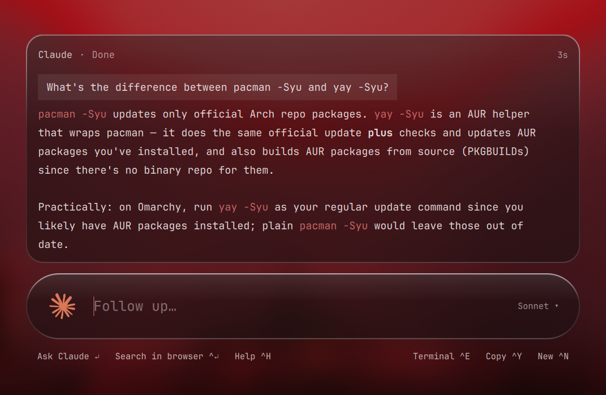
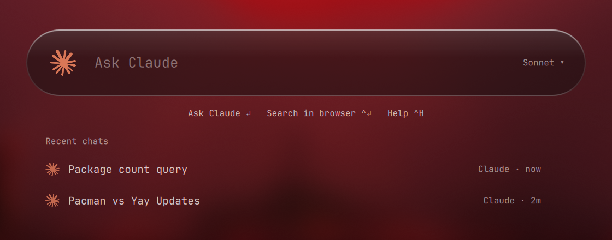
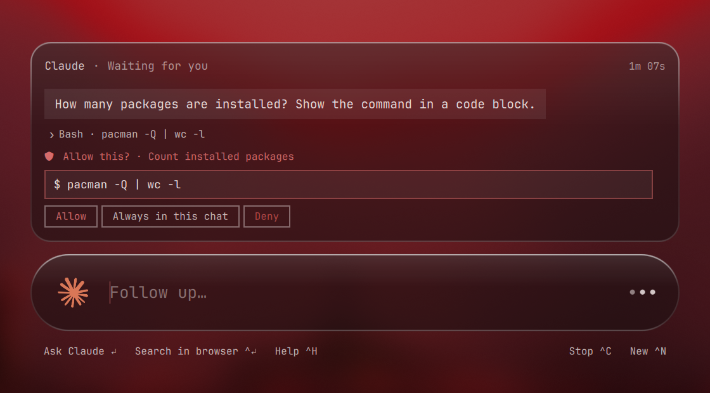
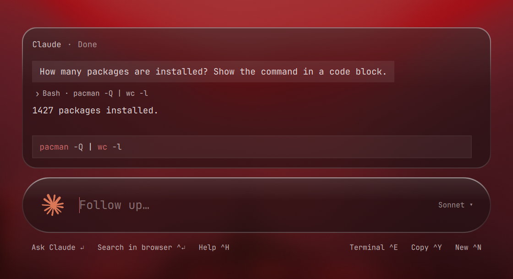
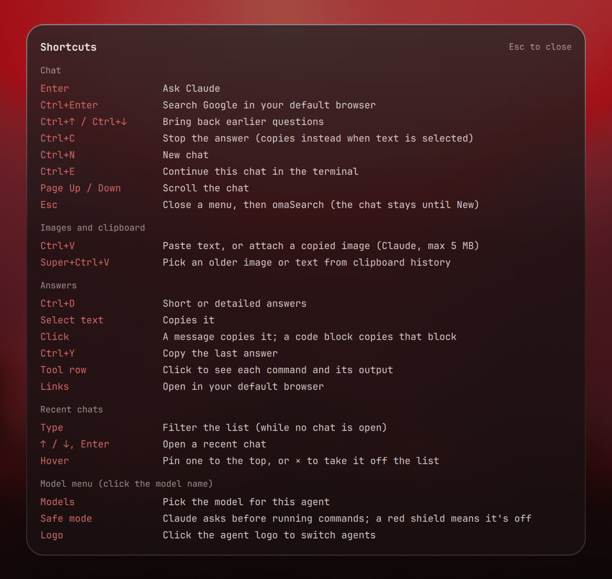

# omaSearch

Quick AI search for [Omarchy](https://omarchy.org/). Press a key, ask, keep working.

> **One box, two ways to search.** Type your question, then:
>
> - **Enter** asks your AI agent (Claude, Codex, OpenCode…) and shows the answer right there.
> - **Ctrl+Enter** searches Google for it in your default browser.


omaSearch opens a glass overlay over whatever you're doing, sends your question to Claude (or your default agent: Codex, OpenCode, Gemini, Grok, Crush, Pi), and shows the answer right there, formatted. Follow up in the same chat, reopen a recent one, paste an image, and approve the commands Claude wants to run.

**Plugin id:** `io.github.5h3rd1l.omasearch` · **License:** MIT · **Version:** 1.0.0

Based on [omAsk](https://github.com/shabdar/omarchy-ask) by Ali Shabdar.

## Features

- **Ask or Google, same box.** Enter sends the question to your agent; Ctrl+Enter searches Google in your default browser instead.
- **Fast answers.** Claude answers stream in from a process that starts the moment omaSearch opens, so replies begin at once. Follow-ups continue the same Claude session.
- **Readable answers.** Paragraphs, lists, tables, headings, syntax-coloured code blocks with a Copy button, and links that open in your browser.
- **See what it ran.** When Claude runs commands, click the step to see each command and its output.
- **Safe mode** (on by default). Before Claude runs a command you get **Allow**, **Always in this chat** or **Deny**.
- **Recent chats.** Listed under the input when no chat is open, including older omaSearch chats Claude has on disk. Type to filter, ↑/↓ then Enter to open, pin the ones you keep. New chats get a short title.
- **Images.** Paste one with Ctrl+V, or pick an older one from clipboard history (Super+Ctrl+V).
- **Copy anything.** Selecting text copies it; a click copies a whole message or code block.
- **Temporary chats** (Ctrl+I) for a quick question you don't want kept.
- **Short or detailed answers**, a model picker and an agent picker.
- **Liquid-glass look** that follows your Omarchy theme.
- **Ctrl+H** shows every shortcut.

## Screenshots

| | |
| --- | --- |
|  |  |
| **Formatted answers** with coloured inline code | **Recent chats** when no chat is open |
|  |  |
| **Safe mode**: Allow, Always in this chat, or Deny | **Tool steps**: click to see the command and its output |



## Install

```bash
omarchy plugin add https://github.com/5h3rd1l/omaSearch.git --enable --yes
```

Installing doesn't touch your config. Add a key and the glass blur to `~/.config/hypr/bindings.lua`:

```lua
o.bind("SUPER + Q", "omaSearch", "omarchy-shell shell toggle io.github.5h3rd1l.omasearch '{}'")
-- Glass: blur behind the card and the input, not the dimmed backdrop.
hl.layer_rule({ match = { namespace = "^omasearch$" }, blur = true, ignore_alpha = 0.45 })
```

`SUPER + Q` is free on a stock Omarchy setup; pick another key if you use it.

Then set an agent (Claude works best: streaming, safe mode, images and recent chats):

```bash
omarchy default agent claude
```

Update or remove:

```bash
omarchy plugin update io.github.5h3rd1l.omasearch
omarchy plugin remove io.github.5h3rd1l.omasearch --yes
```

## Use

| Key | Does |
| --- | --- |
| Super+Q | Open / close |
| Enter | Ask |
| Shift+Enter | New line (the input grows with your text) |
| Ctrl+Enter | Search Google in your default browser |
| Ctrl+↑ / Ctrl+↓ | Bring back earlier questions |
| Ctrl+C | Stop the answer (copies instead when text is selected) |
| Ctrl+N | New chat |
| Ctrl+I | Temporary chat: nothing is saved, and it stays out of recent chats (Ctrl+I again ends it) |
| Ctrl+E | Continue the chat in the terminal (Claude, Codex, OpenCode) |
| Ctrl+Y | Copy the last answer |
| Ctrl+D | Short or detailed answers |
| Ctrl+V | Paste text, or attach a copied image (Claude, max 5 MB) |
| Super+Ctrl+V | Pick an older image or text from clipboard history |
| Ctrl+H | All shortcuts |
| Page Up / Down | Scroll the chat |
| Esc | Close a menu, then omaSearch (the chat stays until New) |

With no chat open, recent chats are listed under the input: type to filter them, ↑/↓ and Enter to open one, and hover to pin or remove one. Click the model name for the model list and the **Detailed answers** and **Safe mode** switches, and the agent logo to switch agents.

## Safe mode

On by default. Claude asks before running a command, and omaSearch shows it with **Allow**, **Always in this chat** and **Deny**. Read-only commands Claude considers harmless run without asking. Turn it off in the model menu and Claude runs commands (including passwordless sudo, if you have it) without asking; a shield next to the model name reminds you.

For other agents, safe mode keeps Codex in its read-only sandbox and OpenCode on its plan agent.

## Your data

- **Saved chats** (last 25, plus pinned ones): `~/.local/state/omasearch/history.json`, with settings and the pill position alongside. The folder is private to you (0700). Delete the file to forget them.
- **Claude chats** also come from Claude's own session files (omaSearch's print-mode sessions in `~/.claude/projects/<your home>/`). Removing a chat from the list only hides it; Claude's file stays.
- **Pasted images** go to `~/.cache/omasearch/shots` and are deleted once sent (unsent ones after an hour).
- **Titles** for new chats come from one quick Claude Haiku call per chat, with no saved session.
- **Temporary chats** (Ctrl+I) aren't saved anywhere by omaSearch: no recent-chats entry, no title, no question history. Claude and Codex run without saving the session either. OpenCode has no such option and keeps its own log.

Nothing is sent anywhere except to the agent you ask.

## Requirements

- Omarchy with `omarchy-shell` (Quickshell)
- Python 3
- An agent CLI on `PATH`, for example Claude Code (`omarchy default agent claude` installs it)
- `wl-clipboard` (`wl-copy`, `wl-paste`), stock on Omarchy

See [ARCHITECTURE.md](ARCHITECTURE.md) for how it works.

## Credits

omaSearch started as a fork of [omAsk](https://github.com/shabdar/omarchy-ask) by Ali Shabdar, and keeps its MIT license.

## License

MIT. See [LICENSE](LICENSE).
